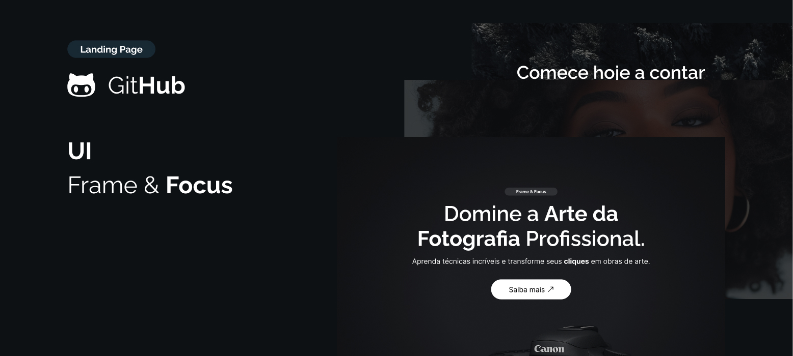

# Frame & Focus
Landing page que simula um curso de fotografia profissional.

## Sobre o Projeto
O Frame & Focus é uma landing page desenvolvida com HTML e CSS, com foco em design moderno e responsivo. O projeto simula uma página de venda de um curso de fotografia, com seções como:

- Hero Section
- Módulos do Curso
- Seção Visual Parallax
- Chamada para Profissionais
- Footer com links sociais

### Tecnologias Utilizadas
- HTML5
- CSS3 (Flexbox + Grid + Custom Properties + Responsividade)
- Google Fonts (Inter e Raleway)
- SVG e imagens otimizadas

### Responsividade
O layout foi planejado para funcionar bem em:
- Desktop
- Tablets
- Mobile

Usando uma combinação de Grid Layout, Flexbox e ajustes com Media Queries.

Você pode abrir o arquivo index.html direto no navegador.

---

## Autor

Feito com 💜 por Shayare 🐈
